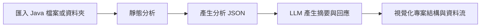

# FZF Code Analyzer

FZF Code Analyzer 是一個以 JavaFX 建立的 Java 專案分析工具。使用者可以匯入 Java 檔案或整個資料夾，系統會先透過靜態分析整理出類別、方法、欄位、參數、繼承、實作與方法呼叫關係，再結合 LLM 產生專案摘要與問答回應，最後透過 Cytoscape 將專案結構視覺化。

這個專案的目標是幫助使用者更快理解陌生 Java 專案的架構與資料流，減少只靠人工閱讀大量程式碼所花費的時間。

## 核心功能

- 匯入單一或多個 Java 檔案
- 匯入 Java 專案資料夾並自動掃描 `.java` 檔案
- 分析類別、介面、方法、欄位、參數與註解
- 分析 `extends`、`implements` 與方法呼叫關係
- 產生 JSON 格式的專案分析結果
- 使用 Gemini API 產生專案摘要與互動式問答
- 在 Cytoscape 視覺化畫面中顯示檔案、類別與 AI 判斷出的資料流
- 提供推薦問題，協助使用者探索專案架構

## 系統流程



## 技術架構

| 類別 | 技術 |
| --- | --- |
| 開發語言 | Java 21 |
| 專案管理 | Maven |
| 桌面介面 | JavaFX |
| 前端視覺化 | JavaFX WebView、HTML、CSS、JavaScript |
| 圖形化工具 | Cytoscape.js |
| 程式碼解析 | JavaParser |
| JSON 處理 | Jackson、Gson |
| LLM 服務 | Gemini 2.5 Flash API |
| 測試框架 | JUnit 5 |

## 專案結構

```text
software-Engineering-project/
├── pom.xml
├── src/
│   ├── main/
│   │   ├── java/com/water/fzfwificenter/
│   │   │   ├── Main.java
│   │   │   ├── MainApp.java
│   │   │   ├── UI/
│   │   │   ├── analyzer/
│   │   │   ├── llm/
│   │   │   ├── model/
│   │   │   └── Visualizer/
│   │   └── resources/
│   │       ├── index.html
│   │       ├── chat.html
│   │       ├── editor.html
│   │       └── style.css
│   └── test/
│       └── java/com/water/fzfwificenter/test/
└── README.md
```

## 主要模組說明

### `analyzer`

負責 Java 靜態分析。核心類別包含：

- `JavaCodeAnalyzer`：分析單一 Java 原始碼，擷取 class、method、field、parameter、annotation、method call 等資訊。
- `ProjectJavaAnalyzer`：掃描整個 Java 專案，彙整多個檔案的分析結果。
- `ProjectSummaryBuilder`：將完整分析結果整理成較適合 UI 與 LLM 使用的專案摘要。
- `AnalyzerFactoryProvider`、`JavaAnalyzerFactory`：使用工廠模式建立不同語言的分析器，目前主要支援 Java。

### `UI`

負責桌面應用程式畫面與互動流程。

- `MainScreen`：主畫面，包含匯入按鈕、視覺化區域與聊天區域。
- `ProjectImportService`：處理檔案匯入、靜態分析與 JSON 輸出。
- `ChatController`：負責 AI 問答、推薦問題與視覺化節點連動。
- `NodeAnalysisController`：處理使用者點選節點後的分析動作。
- `JavaBridge`：作為 JavaFX WebView 中 JavaScript 與 Java 程式之間的橋接。

### `llm`

負責與 Gemini API 溝通。

- `LLMService`：將專案分析 JSON 與使用者問題組成 prompt，呼叫 Gemini API 並解析回應。

### `resources`

存放 WebView 使用的前端檔案。

- `index.html`：Cytoscape 專案結構視覺化畫面。
- `chat.html`：AI 聊天介面。
- `style.css`：JavaFX 主畫面樣式。

## 環境需求

- JDK 21
- Maven
- 網路連線
- Gemini API Key

如果只測試基本 Java 程式碼分析，可以不設定 API Key；但若要使用 AI 摘要、問答與推薦問題，需要設定 `GEMINI_API_KEY`。

## API Key 設定

請先在系統環境變數中設定：

```powershell
$env:GEMINI_API_KEY="你的 Gemini API Key"
```

以上設定只會套用在目前 PowerShell 視窗。如果要永久設定，請改到系統環境變數中新增 `GEMINI_API_KEY`。

## 執行方式

在專案根目錄執行：

```powershell
mvn clean javafx:run
```

啟動後可以在上方工具列選擇：

- `匯入檔案`：選取一個或多個 Java 檔案
- `匯入資料夾`：選取整個 Java 專案資料夾
- `重置視角`：重置 Cytoscape 視覺化畫面
- `清除對話`：清空右側 AI 對話紀錄

## 測試方式

執行單元測試：

```powershell
mvn test
```

目前測試主要針對 `JavaCodeAnalyzer`，驗證空輸入、語法錯誤、類別分析、方法參數、繼承實作、註解、欄位與方法呼叫擷取等行為。

## 輸出結果

匯入 Java 檔案後，系統會產生分析用 JSON，供 UI、LLM 與視覺化模組使用。主要輸出內容包含：

- 檔案名稱
- 類別名稱
- 方法名稱
- 欄位與參數資訊
- 類別依賴關係
- 方法呼叫關係

## 開發方法

本專案適合採用「統合流程 + Scrum」的方式開發。統合流程可以協助團隊先掌握需求、架構與風險，再逐步完成系統分析、設計、實作與測試；Scrum 則適合處理專題開發中常見的需求變動，讓團隊透過短週期討論、展示與回饋，持續調整功能與畫面。

由於本專案的核心價值在於「透過討論理解專案架構」，而 LLM 回應、視覺化呈現與使用者互動方式都可能在開發過程中頻繁修改，因此結合兩種方法能同時保留整體規劃與開發彈性。

## 未來可擴充方向

- 支援 Python、C++ 等其他程式語言
- 強化跨檔案方法呼叫解析
- 優化 Cytoscape 節點排版與資料流顯示
- 加入更多專案品質指標
- 支援匯出分析報告或 README 草稿
- 強化 LLM 回應格式驗證與錯誤處理

